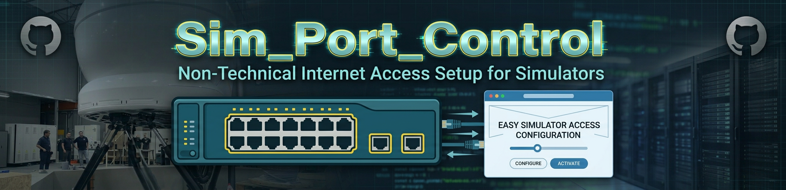
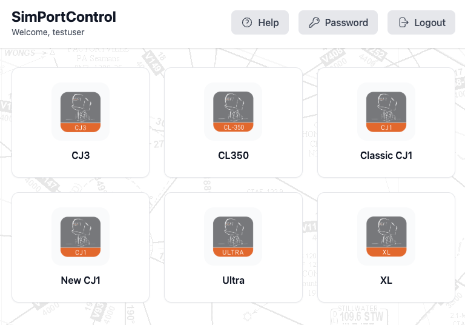
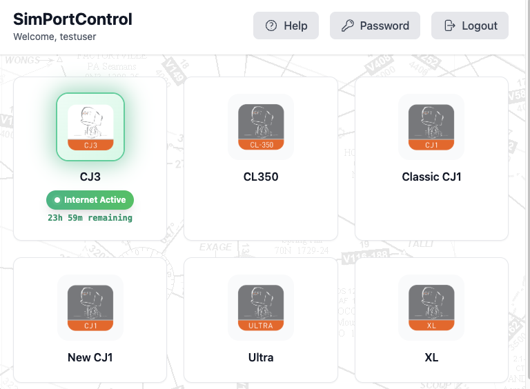
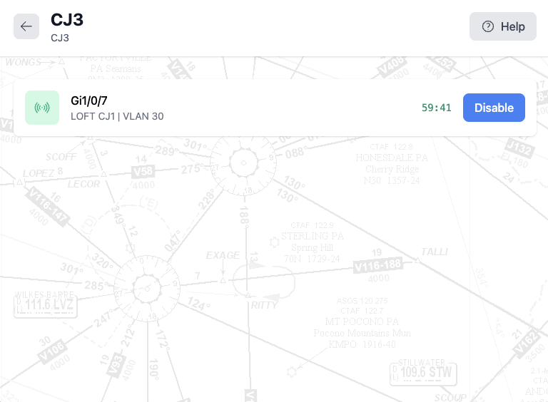
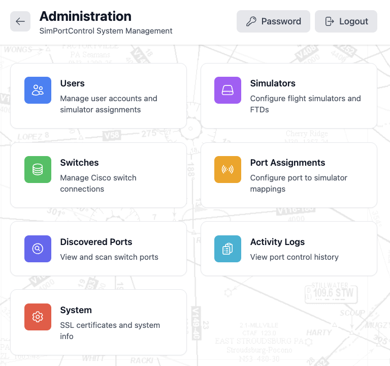
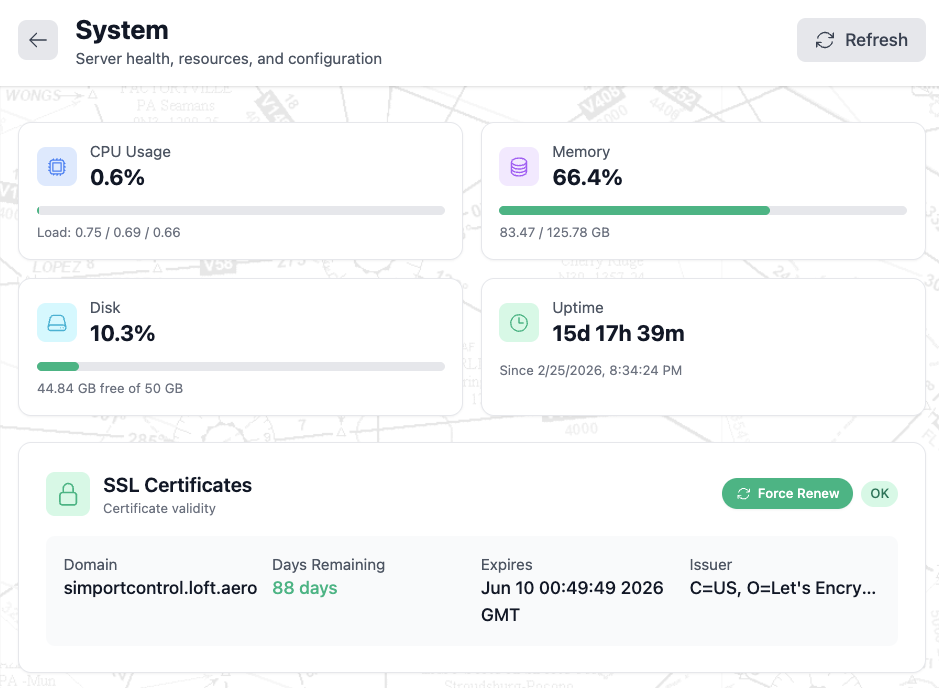
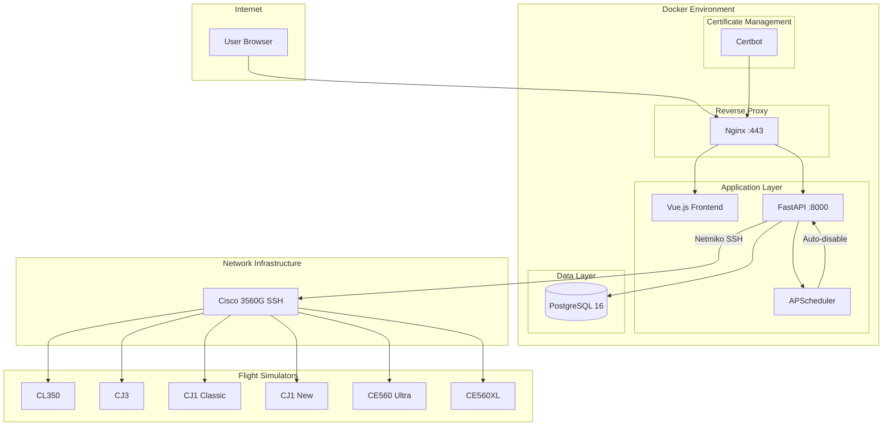

<p align="center">
  
</p>

<p align="center">
  <a href="LICENSE"></a>
  <a href="https://github.com/rjsears/sim_port_control/commits"></a>
  <a href="https://github.com/rjsears/sim_port_control/issues"></a>
  <a href="docs/CHANGELOG.md"></a>
  [](https://codecov.io/gh/rjsears/sim_port_control)
</p>

<p align="center">
  <a href="https://fastapi.tiangolo.com"></a>
  <a href="https://vuejs.org"></a>
  <a href="https://www.postgresql.org"></a>
  <a href="https://docker.com"></a>
  <a href="https://nginx.org"></a>
  <a href="https://letsencrypt.org"></a>
</p>

<p align="center">
  <a href="https://www.cisco.com"></a>
  <a href="https://tailwindcss.com"></a>
</p>

> ### *"Simplicity is the ultimate sophistication."* — Leonardo da Vinci

---

# Sim_Port_Control

Sim_Port_Control is a web-based switch port management system designed for flight simulator training facilities. It provides a simple, secure interface for non-technical staff to enable and disable internet access to flight simulators via Cisco switch port control. The system features automatic timeout protection, role-based access control, comprehensive activity logging, and a mobile-friendly interface.

---

## Table of Contents

### Part I: Introduction
- [1. Overview](#1-overview)
  - [1.1 What is Sim_Port_Control?](#11-what-is-simportcontrol)
  - [1.2 Key Features](#12-key-features)
  - [1.3 Screenshots](#13-screenshots)
  - [1.4 Architecture Overview](#14-architecture-overview)
  - [1.5 Technology Stack](#15-technology-stack)

### Part II: Installation
- [2. System Requirements](#2-system-requirements)
  - [2.1 Hardware Requirements](#21-hardware-requirements)
  - [2.2 Software Requirements](#22-software-requirements)
  - [2.3 Network Requirements](#23-network-requirements)
- [3. Installation](#3-installation)
  - [3.1 Quick Start](#31-quick-start)
  - [3.2 SSL Certificate Setup](#32-ssl-certificate-setup)
  - [3.3 First-Time Configuration](#33-first-time-configuration)

### Part III: Configuration
- [4. Switch Configuration](#4-switch-configuration)
  - [4.1 Cisco Switch Setup](#41-cisco-switch-setup)
  - [4.2 Adding Switches to SimPortControl](#42-adding-switches-to-simportcontrol)
- [5. Simulator Configuration](#5-simulator-configuration)
  - [5.1 Adding Simulators](#51-adding-simulators)
  - [5.2 Port Assignments](#52-port-assignments)
- [6. User Management](#6-user-management)
  - [6.1 User Roles](#61-user-roles)
  - [6.2 Simulator Assignments](#62-simulator-assignments)

### Part IV: Usage
- [7. SimTech Interface](#7-simtech-interface)
  - [7.1 Activating Ports](#71-activating-ports)
  - [7.2 Deactivating Ports](#72-deactivating-ports)
  - [7.3 Understanding Timeouts](#73-understanding-timeouts)
- [8. Admin Interface](#8-admin-interface)
  - [8.1 Dashboard](#81-dashboard)
  - [8.2 Activity Logs](#82-activity-logs)
  - [8.3 System Settings](#83-system-settings)

### Part V: Operations
- [9. SSL Certificate Management](#9-ssl-certificate-management)
- [10. Backup and Recovery](#10-backup-and-recovery)
- [11. Troubleshooting](#11-troubleshooting)

### Part VI: Reference
- [12. API Reference](#12-api-reference)
- [13. Environment Variables](#13-environment-variables)
- [14. Port Reference](#14-port-reference)

### Appendices
- [Appendix A: Cisco Switch SSH Configuration](#appendix-a-cisco-switch-ssh-configuration)

### Detailed Guides
- [API Reference](./docs/API.md) - REST API documentation
- [Architecture](./docs/ARCHITECTURE.md) - System architecture details
- [Certbot Guide](./docs/CERTBOT.md) - SSL certificate management
- [Changelog](./docs/CHANGELOG.md) - Version history
- [Troubleshooting](./docs/TROUBLESHOOTING.md) - Common issues and solutions

---

# Part I: Introduction

## 1. Overview

### 1.1 What is SimPortControl?

SimPortControl is a specialized network access management system built for our flight simulator training facilities (LOFT). It solves a common operational challenge: flight simulators typically should not have internet access during training sessions, but occasionally need connectivity for software updates or remote support.

Rather than requiring technical staff to manually configure switch ports, SimPortControl provides a simple web interface where authorized personnel can:

- **Enable** internet access to specific simulators with a single click
- **Set automatic timeouts** to ensure ports are disabled after a configured period
- **Track all activity** with comprehensive logging of who enabled/disabled what and when
- **Manage access** through role-based permissions (Admin vs SimTech)

```
┌─────────────────────────────────────────────────────────────────────────────┐
│                            SimPortControl                                   │
│                     Web-Based Port Management Interface                     │
└─────────────────────────────────────────────────────────────────────────────┘
                                      │
                              HTTPS (Port 443)
                                      │
                                      ▼
┌─────────────────────────────────────────────────────────────────────────────┐
│                              Docker Stack                                   │
├─────────────────────────────────────────────────────────────────────────────┤
│  ┌─────────────┐  ┌─────────────┐  ┌─────────────┐  ┌─────────────┐         │
│  │    Nginx    │  │   FastAPI   │  │  PostgreSQL │  │   Certbot   │         │
│  │   :443/:80  │──│    :8000    │──│    :5432    │  │  (SSL/TLS)  │         │
│  └─────────────┘  └─────────────┘  └─────────────┘  └─────────────┘         │
└─────────────────────────────────────────────────────────────────────────────┘
                                      │
                                 SSH (Port 22)
                                      │
                                      ▼
┌─────────────────────────────────────────────────────────────────────────────┐
│                         Cisco 3560G Switch                                  │
├─────────────────────────────────────────────────────────────────────────────┤
│  Port 1: CL350 Challenger    Port 4: CJ1 New         Port 7: [Available]    │
│  Port 2: CJ3                 Port 5: CE560 Ultra     Port 8: [Available]    │
│  Port 3: CJ1 Classic         Port 6: CE560XL         ...                    │
└─────────────────────────────────────────────────────────────────────────────┘
                                      │
                              Ethernet Connections
                                      │
                                      ▼
┌─────────────────────────────────────────────────────────────────────────────┐
│                          Flight Simulators                                  │
├─────────────────────────────────────────────────────────────────────────────┤
│  ┌─────────┐  ┌─────────┐  ┌─────────┐  ┌─────────┐  ┌─────────┐  ┌───────┐ │
│  │  CL350  │  │   CJ3   │  │CJ1 Clsc │  │ CJ1 New │  │  Ultra  │  │  XL   │ │
│  └─────────┘  └─────────┘  └─────────┘  └─────────┘  └─────────┘  └───────┘ │
└─────────────────────────────────────────────────────────────────────────────┘
```

### 1.2 Key Features

#### Port Control
| Feature | Description |
|---------|-------------|
| **One-Click Activation** | Enable simulator internet access with a single tap |
| **Automatic Timeout** | Ports automatically disable after configured duration |
| **Custom Timeout Selection** | Choose from preset durations (1 hour to 1 week) or "Always On" |
| **Admin Force Enable** | Administrators can force-enable ports with custom timeouts |
| **VLAN Support** | Configure per-port VLAN assignments (default: VLAN 30) |
| **Real-Time Status** | See current port state with visual indicators |
| **Port Discovery** | Scan switches to automatically discover available ports |

#### User Management
| Feature | Description |
|---------|-------------|
| **Role-Based Access** | Admin and SimTech user roles with different permissions |
| **Simulator Assignments** | SimTechs can only control their assigned simulators |
| **Password Self-Service** | Users can change their own passwords |
| **Activity Logging** | Complete audit trail of all port changes |
| **Session Management** | Secure JWT-based authentication |

#### Administration
| Feature | Description |
|---------|-------------|
| **Multi-Switch Support** | Manage multiple Cisco switches from one interface |
| **Flexible Port Mapping** | Assign multiple ports per simulator if needed |
| **Configurable Timeouts** | Set default timeout per port (in hours) |
| **SSL Management** | View certificate status with color-coded expiry, force renewal with confirmation |
| **Port Discovery** | Scan and discover switch ports with status indicators |
| **System Health Dashboard** | Monitor system status, database, and SSL certificates |

#### Modern Interface
| Feature | Description |
|---------|-------------|
| **Mobile-Friendly** | Responsive design works on phones and tablets |
| **Dark/Light Mode** | Theme support for different preferences |
| **Visual Feedback** | Clear blue/emerald signal icons for port status |
| **Countdown Timers** | Show time remaining until auto-disable |
| **Toast Notifications** | Non-intrusive success/error notifications with auto-dismiss |
| **Persistent Modals** | Forms don't close accidentally when clicking outside |
| **Map Background** | Tiled aviation-themed background across all views |

### 1.3 Screenshots

<p align="center">
  <strong>SimTech Dashboard - Inactive Simulators</strong><br/>
  
</p>

<p align="center">
  <strong>SimTech Dashboard - Active Simulator</strong><br/>
  
</p>

<p align="center">
  <strong>Simulator Detail View</strong><br/>
  
</p>

<p align="center">
  <strong>Admin Dashboard</strong><br/>
  
</p>

<p align="center">
  <strong>System Overview & SSL Management</strong><br/>
  
</p>

### 1.4 Architecture Overview



#### Component Overview

| Component | Purpose |
|-----------|---------|
| **Nginx** | Reverse proxy with SSL termination and static file serving |
| **Vue.js Frontend** | Reactive web interface with Tailwind CSS styling |
| **FastAPI Backend** | REST API handling authentication, port control, and scheduling |
| **PostgreSQL** | Persistent storage for users, simulators, switches, and logs |
| **APScheduler** | Background scheduler for automatic port timeout |
| **Certbot** | Automatic SSL certificate acquisition and renewal |
| **Netmiko** | Python library for SSH communication with Cisco switches |
| **Docker SDK** | Container interaction for SSL certificate management |

### 1.5 Technology Stack

#### Backend Technologies

| Technology | Version | Purpose |
|------------|---------|---------|
| Python | 3.11+ | Application runtime |
| FastAPI | Latest | Async REST API framework |
| SQLAlchemy | 2.0 | Async ORM for database operations |
| Alembic | Latest | Database migrations |
| PostgreSQL | 16 | Primary database |
| Netmiko | Latest | Cisco SSH automation |
| APScheduler | Latest | Background task scheduling |
| Pydantic | 2.0 | Data validation and settings |
| Passlib | Latest | Password hashing (bcrypt) |
| PyJWT | Latest | JWT token handling |
| Cryptography | Latest | Fernet encryption for credentials |
| Docker SDK | 7.0+ | Container management for SSL operations |

#### Frontend Technologies

| Technology | Version | Purpose |
|------------|---------|---------|
| Vue.js | 3.4+ | Frontend framework (Composition API) |
| Vite | Latest | Build tool and dev server |
| Vue Router | Latest | Client-side routing |
| Pinia | Latest | State management |
| Tailwind CSS | Latest | Utility-first styling |
| Heroicons | Latest | SVG icon library |
| Axios | Latest | HTTP client |
| Toast Notifications | Custom | Non-intrusive user feedback system |

#### Infrastructure Technologies

| Technology | Purpose |
|------------|---------|
| Docker | Container runtime |
| Docker Compose | Container orchestration |
| Nginx | Reverse proxy and SSL termination |
| Certbot | Let's Encrypt certificate automation |
| LXC | Container host (Proxmox recommended) |

---

# Part II: Installation

## 2. System Requirements

### 2.1 Hardware Requirements

#### Minimum Requirements

| Resource | Minimum | Recommended |
|----------|---------|-------------|
| CPU | 1 core | 2+ cores |
| RAM | 1 GB | 2+ GB |
| Storage | 10 GB | 20+ GB SSD |

> **Note**: SimPortControl is lightweight. These requirements are for the Docker host (LXC container).

### 2.2 Software Requirements

| Software | Notes |
|----------|-------|
| Docker | Automatically installed by setup.sh if not present |
| Docker Compose | V2 plugin (automatically configured) |
| curl | Required for setup script |
| OpenSSL | Required for key generation |

> **Note**: The backend container requires read-only access to the Docker socket (`/var/run/docker.sock`) for SSL certificate management operations. This is configured automatically in the docker-compose files.

#### Supported Platforms

| Platform | Support Level |
|----------|---------------|
| Ubuntu 22.04/24.04 | Recommended |
| Debian 11/12 | Fully supported |
| Proxmox LXC | Fully supported (requires nesting=1) |
| Other Linux | Should work with Docker support |

### 2.3 Network Requirements

| Requirement | Details |
|-------------|---------|
| **Domain Name** | Required for SSL (e.g., simportcontrol.loft.aero) |
| **Port 443** | HTTPS access to web interface |
| **Port 80** | HTTP (redirects to HTTPS, used for cert validation) |
| **SSH to Switch** | Network path from Docker host to Cisco switch |

#### Cisco Switch Requirements

| Requirement | Details |
|-------------|---------|
| **Model** | Cisco 3560G (or compatible IOS switch) |
| **SSH Enabled** | SSH v2 configured on switch |
| **User Account** | Local user with privilege level 15 |
| **Network Access** | Switch management IP reachable from Docker host |

---

## 3. Installation

### 3.1 Quick Start (Using Docker Hub Images)

```bash
# Clone the repository
git clone https://github.com/rjsears/sim_port_control.git
cd sim_port_control

# Run interactive setup
./setup.sh

# Start using pre-built images from Docker Hub
docker compose -f docker-compose.hub.yaml up -d
```

### 3.2 Quick Start (Building Locally)

```bash
# Clone the repository
git clone https://github.com/rjsears/sim_port_control.git
cd sim_port_control

# Build the frontend
cd frontend
npm install
npm run build
cd ..

# Run interactive setup
./setup.sh

# Start with locally built images
docker compose up -d
```

The setup wizard will:
1. **Detect environment** - Check for Docker, system resources
2. **Install Docker** if needed
3. **Configure domain** - Set up simportcontrol.loft.aero
4. **Generate secrets** - Create secure keys for JWT and encryption
5. **Configure database** - Set PostgreSQL credentials
6. **Create admin user** - Initial admin account
7. **Deploy stack** - Start all containers

### 3.2 SSL Certificate Setup

After the initial deployment, run the certificate setup script:

```bash
./scripts/cert_setup.sh
```

This interactive script will:
1. Verify domain DNS resolution
2. Request certificate from Let's Encrypt
3. Configure Nginx with the new certificate
4. Set up automatic renewal

### 3.4 Development Mode

For local development with hot-reload:

```bash
# Start backend services
docker compose up db -d

# Run backend locally
cd backend
python -m venv venv
source venv/bin/activate
pip install -r requirements.txt
uvicorn app.main:app --reload

# Run frontend dev server (separate terminal)
cd frontend
npm install
npm run dev
```

The frontend dev server runs on http://localhost:5173 and proxies API requests to the backend.

### 3.5 First-Time Configuration

1. **Access the web interface**: https://simportcontrol.loft.aero
2. **Login with admin credentials** (created during setup)
3. **Add your Cisco switch** (Admin → Switches)
4. **Add simulators** (Admin → Simulators)
5. **Create port assignments** (Admin → Port Assignments)
6. **Create SimTech users** (Admin → Users)

---

# Part III: Configuration

## 4. Switch Configuration

### 4.1 Cisco Switch Setup

Before adding a switch to SimPortControl, ensure SSH is configured:

```
! Enable SSH on Cisco 3560G
configure terminal
hostname LOFT-SIM-SW01
ip domain-name loft.aero
crypto key generate rsa modulus 2048
ip ssh version 2
ip ssh time-out 60
ip ssh authentication-retries 3

! Create local user for SimPortControl
username simportcontrol privilege 15 secret YourSecurePassword

! Enable SSH on VTY lines
line vty 0 15
 login local
 transport input ssh
end
write memory
```

### 4.2 Adding Switches to SimPortControl

1. Navigate to **Admin → Switches**
2. Click **Add Switch**
3. Enter:
   - **Name**: LOFT-SIM-SW01
   - **IP Address**: 10.0.1.1
   - **Username**: simportcontrol
   - **Password**: YourSecurePassword
4. Click **Test Connection** to verify
5. Click **Save**

---

## 5. Simulator Configuration

### 5.1 Adding Simulators

1. Navigate to **Admin → Simulators**
2. Click **Add Simulator**
3. Enter:
   - **Name**: CL350 Challenger 350
   - **Short Name**: CL350
   - **Icon Path**: Path to icon file (see available icons below)
4. Click **Save**

#### Available Simulator Icons

Icons are located in `/icons/` and come in two variants:
- `*_wht.png` - Color version (displayed when simulator is active)
- `*_gray.png` - Gray version (displayed when simulator is inactive)

| Simulator | Icon Path |
|-----------|-----------|
| CE560 (Ultra) | `/icons/CE560_gray.png` |
| CE560XL | `/icons/XL_gray.png` |
| CJ1 | `/icons/CJ1_gray.png` |
| CJ3 | `/icons/CJ3_gray.png` |
| CL350 | `/icons/CL350_gray.png` |

The system automatically switches between gray and white/color icons based on the simulator's active port status.

### 5.2 Port Assignments

1. Navigate to **Admin → Port Assignments**
2. Click **Add Assignment**
3. Configure:
   - **Simulator**: CL350 Challenger 350
   - **Switch**: LOFT-SIM-SW01
   - **Port**: Gi0/1
   - **VLAN**: 30
   - **Default Timeout**: 4 hours
4. Click **Save**

> **Note**: A simulator can have multiple port assignments if it requires multiple network connections.

---

## 6. User Management

### 6.1 User Roles

| Role | Capabilities |
|------|--------------|
| **Admin** | Full system access: manage switches, simulators, users, view logs, force-enable ports with custom timeouts |
| **SimTech** | Enable/disable ports for assigned simulators only, change own password |

### 6.2 Password Management

All users can change their own password:
1. Click the **Key icon** in the header
2. Enter current password
3. Enter new password (minimum 6 characters)
4. Confirm new password
5. Click **Change Password**

### 6.3 Simulator Assignments

SimTech users can only control simulators they're assigned to:

1. Navigate to **Admin → Users**
2. Click on a SimTech user
3. In **Assigned Simulators**, select the simulators they can control
4. Click **Save**

---

# Part IV: Usage

## 7. SimTech Interface

When a SimTech logs in, they see a grid of their assigned simulators.

### 7.1 Activating Ports

1. Click on a simulator card (shown with gray icon when inactive)
2. View the port list showing port number, switch name, and VLAN for each port
3. Click the green **Enable** button next to the port
4. Select a duration from the dropdown (Default uses configured timeout, or choose 1-24 hours)
5. Click **Enable** to confirm

The signal icon turns emerald, the button changes to **Disable**, and a countdown timer shows time remaining. You're automatically returned to the dashboard. When a single port is active, the timer shows the time (e.g., "2h 30m"). When multiple ports are active, each port's timer is displayed with its interface name (e.g., "Gi1/0/7: 23h 59m").

### 7.2 Deactivating Ports

1. Click on an active simulator (shown with colored icon and green glow)
2. View the port list showing enabled port with emerald signal icon
3. Click the blue **Disable** button
4. Click **Disable** to confirm

You're automatically returned to the dashboard.

### 7.3 Understanding Timeouts

- Each port has a **default timeout** (e.g., 4 hours)
- When activated, a countdown timer displays remaining time
- When the timer reaches zero, the port **automatically disables**
- This prevents accidental extended internet access

---

## 8. Admin Interface

### 8.1 Dashboard

The admin dashboard provides quick access to:
- **Users** - Manage user accounts and simulator assignments
- **Simulators** - Configure flight simulators and FTDs
- **Switches** - Manage Cisco switch connections
- **Port Assignments** - Configure port to simulator mappings
- **Discovered Ports** - View and scan switch ports
- **Activity Logs** - View port control history
- **System** - SSL certificates and system info

### 8.2 Admin Force Enable

Administrators have enhanced port control capabilities:
1. Navigate to a simulator's detail view
2. Click **Admin Force Enable** (visible only to admins)
3. Select a timeout duration:
   - Default (uses port's configured timeout)
   - 1 hour, 2 hours, 4 hours, 8 hours, 12 hours, 24 hours
   - 2 days, 3 days, 1 week
   - **Always On** (until manually disabled)
4. Enter a reason for the override
5. Confirm to activate

Ports enabled with "Always On" display a special badge and the main dashboard shows a "Locked On" indicator with a lock icon. To disable a locked port, simply click **Disable** - this automatically clears the lock.

### 8.3 Port Discovery

Discover available ports on configured switches:
1. Navigate to **Admin → Discovered Ports**
2. Select a switch and click **Scan**
3. View discovered ports with status (up/down)
4. Assign ports to simulators directly from the discovery view

### 8.4 Activity Logs

View complete history of all port changes:
- Who made the change
- What simulator/port
- When it occurred
- Action (activate/deactivate)
- VLAN used
- Reason (for admin force enables)

**Clearing Logs:** Admins can clear all activity logs by clicking the **Clear Logs** button. A confirmation dialog will appear before deletion. This action is permanent and cannot be undone.

### 8.5 System Settings

Configure system-wide settings:
- View system health status
- Monitor database connectivity
- SSL certificate management (see Section 9)

---

# Part V: Operations

## 9. SSL Certificate Management

### Viewing Certificate Status

Navigate to **Admin → System** to view SSL certificate information:

| Field | Description |
|-------|-------------|
| **Domain** | The domain name covered by the certificate |
| **Days Remaining** | Color-coded indicator (green >30, yellow 15-30, red <15) |
| **Expires** | Exact expiration date and time |
| **Status** | Current certificate validity status |

### Force Renewal

To manually renew the SSL certificate:
1. Navigate to **Admin → System**
2. Click **Force Renew** in the SSL Certificate section
3. Optionally check **Dry run** to test without making changes
4. Click **Force Renew** (or **Run Dry Test** if dry run is checked)
5. Wait for the renewal process to complete (may take 60-90 seconds for DNS validation)
6. Review the full certbot output displayed in the dialog
7. A toast notification will confirm success or show any errors

> **Dry Run Mode**: The dry run option tests the renewal process without actually requesting a new certificate. This is useful for verifying your DNS configuration without consuming Let's Encrypt rate limits.

> **Note**: Force renewal uses certbot inside the Docker container to request a new certificate from Let's Encrypt. Nginx is automatically reloaded after successful renewal.

### Automatic Renewal

Certbot automatically renews certificates when they have less than 30 days remaining. The renewal check runs every 12 hours.

---

## 10. Backup and Recovery

### Database Backup

```bash
# Manual backup
docker compose exec db pg_dump -U simportcontrol simportcontrol > backup.sql

# Restore from backup
cat backup.sql | docker compose exec -T db psql -U simportcontrol simportcontrol
```

### Full System Backup

Back up these directories:
- `.env` - Environment configuration
- `data/` - Persistent data volumes

---

## 11. Troubleshooting

| Issue | Solution |
|-------|----------|
| **Cannot connect to switch** | Verify SSH is enabled, credentials are correct, and network path exists |
| **Port won't disable** | Check switch connectivity; manually verify port state via CLI |
| **Certificate error** | Run `./scripts/cert_setup.sh` to renew certificate |
| **Login fails** | Check database connectivity; verify user exists |
| **Timeout not working** | Check APScheduler is running in container logs |

For detailed troubleshooting, see [docs/TROUBLESHOOTING.md](./docs/TROUBLESHOOTING.md).

---

# Part VI: Reference

## 12. API Reference

See [docs/API.md](./docs/API.md) for complete API documentation.

### Quick Reference

```bash
# Authenticate
POST /api/auth/login
Content-Type: application/x-www-form-urlencoded
username=admin&password=secret

# Change password
POST /api/auth/change-password
Authorization: Bearer <token>
Content-Type: application/json
{"current_password": "old", "new_password": "new"}

# Get current user info
GET /api/auth/me
Authorization: Bearer <token>

# Get all simulators
GET /api/simulators
Authorization: Bearer <token>

# Enable port
POST /api/ports/{port_id}/enable
Authorization: Bearer <token>

# Enable port with custom timeout
POST /api/ports/{port_id}/enable
Authorization: Bearer <token>
Content-Type: application/json
{"timeout_hours": 8}

# Disable port
POST /api/ports/{port_id}/disable
Authorization: Bearer <token>

# Admin force enable (requires admin role)
POST /api/ports/{port_id}/force-enable
Authorization: Bearer <token>
Content-Type: application/json
{"reason": "Software update required", "timeout_hours": null}

# Get SSL certificate info
GET /api/system/ssl
Authorization: Bearer <token>

# Force SSL certificate renewal (admin only)
POST /api/system/ssl/renew?dry_run=false
Authorization: Bearer <token>
# Set dry_run=true to test without making changes

# Scan switch for ports (admin only)
POST /api/discovery/switches/{switch_id}/scan
Authorization: Bearer <token>

# Get discovered ports for a switch
GET /api/discovery/switches/{switch_id}/ports
Authorization: Bearer <token>
```

---

## 13. Environment Variables

See [.env.example](./.env.example) for all configuration options.

| Variable | Description | Default |
|----------|-------------|---------|
| `DOMAIN` | Domain for SSL certificate | simportcontrol.loft.aero |
| `SECRET_KEY` | JWT signing key | (generated) |
| `ENCRYPTION_KEY` | Fernet key for credentials | (generated) |
| `DATABASE_PASSWORD` | PostgreSQL password | (generated) |
| `DEFAULT_TIMEOUT_HOURS` | Default port timeout | 4 |
| `DEFAULT_VLAN` | Default VLAN assignment | 30 |

---

## 14. Port Reference

| Service | Internal Port | External Access | Notes |
|---------|---------------|-----------------|-------|
| Nginx | 443, 80 | Yes | HTTPS entry point |
| FastAPI | 8000 | No (internal) | Backend API |
| PostgreSQL | 5432 | No (internal) | Database |

---

# Appendices

## Appendix A: Cisco Switch SSH Configuration

Complete configuration for enabling SSH on Cisco 3560G:

```
! Basic switch configuration
configure terminal
hostname LOFT-SIM-SW01
ip domain-name loft.aero

! Generate RSA keys for SSH
crypto key generate rsa modulus 2048

! Configure SSH settings
ip ssh version 2
ip ssh time-out 60
ip ssh authentication-retries 3

! Create user for SimPortControl
username simportcontrol privilege 15 secret 0 YourSecurePassword

! Configure VTY lines for SSH only
line vty 0 15
 login local
 transport input ssh
 exec-timeout 10 0
end

! Save configuration
write memory

! Verify SSH is working
show ip ssh
show ssh
```

---

## License

This project is licensed under the MIT License - see the [LICENSE](LICENSE) file for details.

---

## Acknowledgments

- [FastAPI](https://fastapi.tiangolo.com/) - Modern Python web framework
- [Vue.js](https://vuejs.org/) - Progressive JavaScript framework
- [Tailwind CSS](https://tailwindcss.com/) - Utility-first CSS framework
- [Netmiko](https://github.com/ktbyers/netmiko) - Multi-vendor network device SSH library
- [Let's Encrypt](https://letsencrypt.org/) - Free SSL certificates

---

## Support

- **Issues**: [GitHub Issues](https://github.com/rjsears/sim_port_control/issues)
- **Discussions**: [GitHub Discussions](https://github.com/rjsears/sim_port_control/discussions)

---

## Special Thanks

* **My amazing and loving family!** My family puts up with all my coding and automation projects and encourages me in everything. Without them, my projects would not be possible.
* **My brother James**, who is a continual source of inspiration to me and others. Everyone should have a brother as awesome as mine!

---

## Author

**Richard J. Sears**
- GitHub: [@rjsears](https://github.com/rjsears)

---

*Simplifying simulator network management, one port at a time.*
